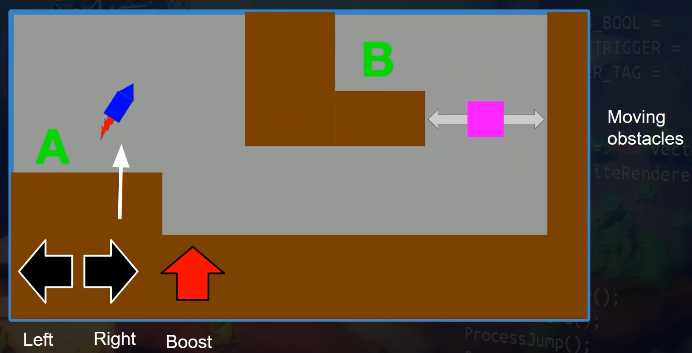
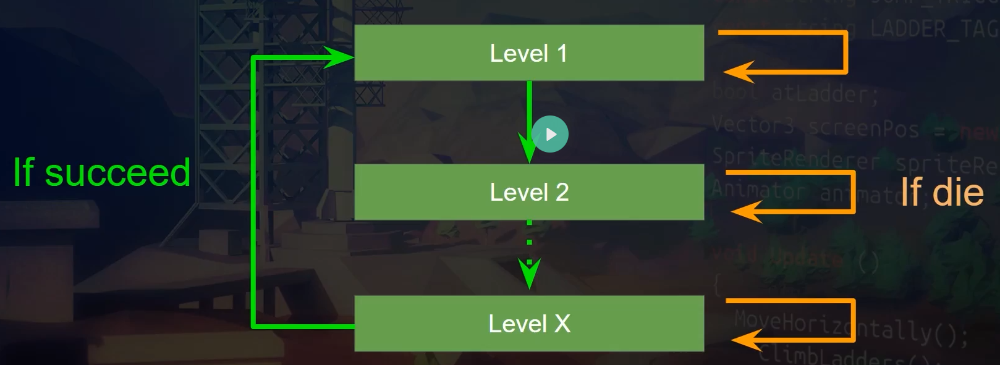

## [gamedev.tv]

### course: Complete Unity 3D Developer

#### project: Project Boost 

`[Unity ver.: 2022.3.30f1]`

Juego simple 3D de habilidad espacial multinivel tipo puzzle.

#### Game Screen

#### Game Design

- **Experiencia de juego:**

Precisión, Habilidad.

- **Mecánica principal:**

Volar la nave con habilidad evitando los peligros del entorno.

- **Bucle principal:**

Ir desde el punto A al B para completar el nivel y progrsar al siguiente nivel.

- **Flujo y Pantallas:**

#### Tema del Juego (Story & Visuals)

- Experimentar una nave espacial de primera generación

- En un planeta desconocido, tratando de escapar

